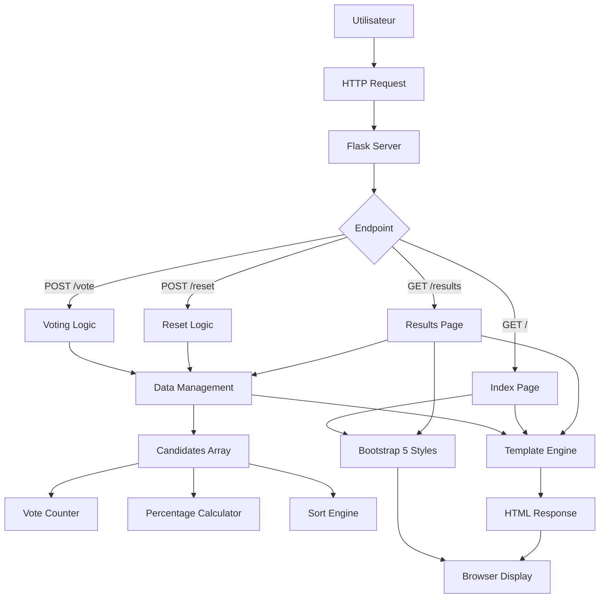
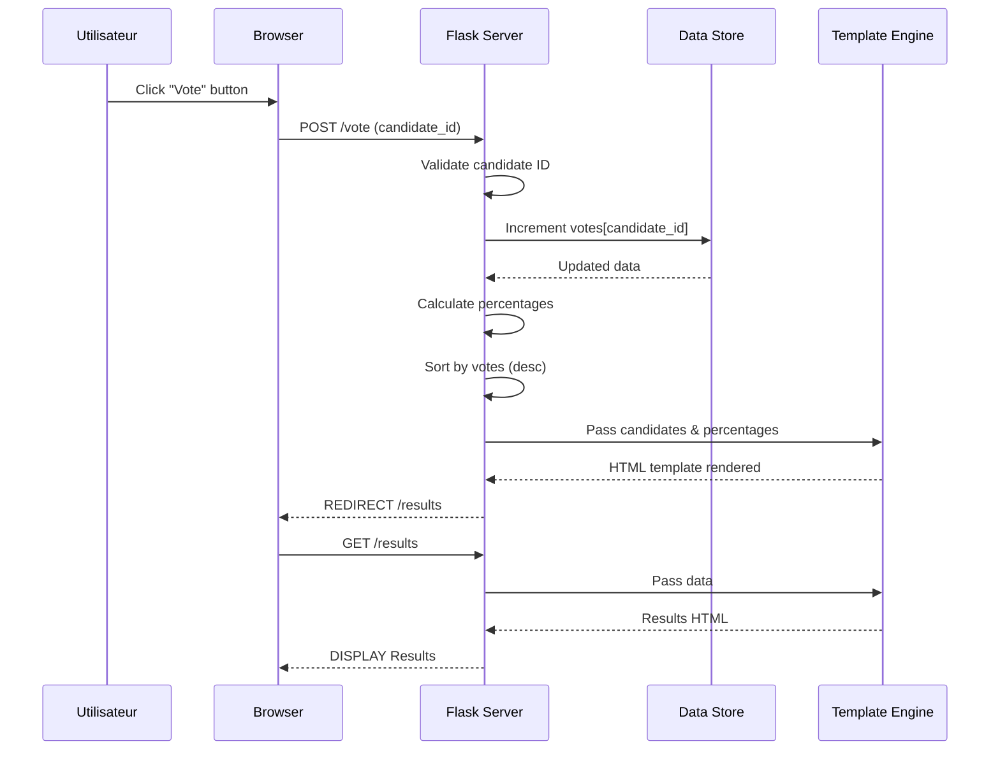
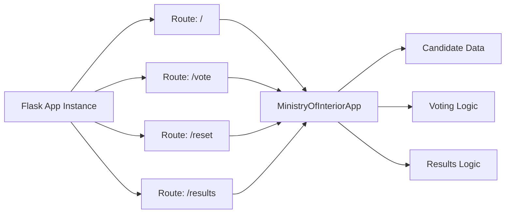

# Architecture du Système

## Diagramme de haute niveau

## Flux de données détaillé

### Vote Flow

## Architecture modulaire

### Layer 1: Interface (Templates)
- **Format** : HTML5 + Bootstrap 5
- **Responsiveness** : Mobile-first design
- **Interactivité** : AJAX-ready, animated elements

### Layer 2: Logic (Flask Routes)
- **index()** : Render voting page
- **vote()** : Process voting request
- **reset()** : Reset election data
- **results()** : Display statistics

### Layer 3: Data (In-memory)
- **Structure** : List of dictionaries
- **Content** : Candidate IDs, names, parties, votes
- **Scope** : Session-only (default Flask behavior)

### Layer 4: Engine (Flask Application)
- **Framework** : Flask (MVC simplified)
- **Routing** : URL-to-function mapping
- **Rendering** : Jinja2 template engine
- **Session Management** : Built-in Flask sessions

## Technologies employées

### Front-end
- **Bootstrap 5** : Framework CSS
- **CDN** : External dependencies (scripts, styles)
- **HTML** : Semantic markup
- **CSS** : Custom styles + gradients
- **JavaScript** : Bootstrap integration

### Back-end
- **Python 3** : Language d'exécution
- **Flask** : Web framework micro
- **Jinja2** : Template processor
- **Werkzeug** : Security & utils (part of Flask)

## Structure de contrôle

## Sécurité basique

- Input validation sur `candidate_id` (int)
- Protection contre injection (Jinja2 auto-escaping)
- Redirection sécurisée (Flask url_for)
- Pas de persistance de données sensibles

## Scalabilité

- **Oui** : Micro-framework, simple à étendre
- **Oui** : Architecture modulaire
- **Non** : Limité par Flask (pas d'ORM natif)
- **Non** : Pas de support natif HTTP/2

## Maintenance et évolution

- **Tests unitaires** : À ajouter
- **Migrations** : À prévoir si base de données
- **Monitoring** : Flask debug mode (dev) uniquement
- **Logging** : Manquant (à ajouter)