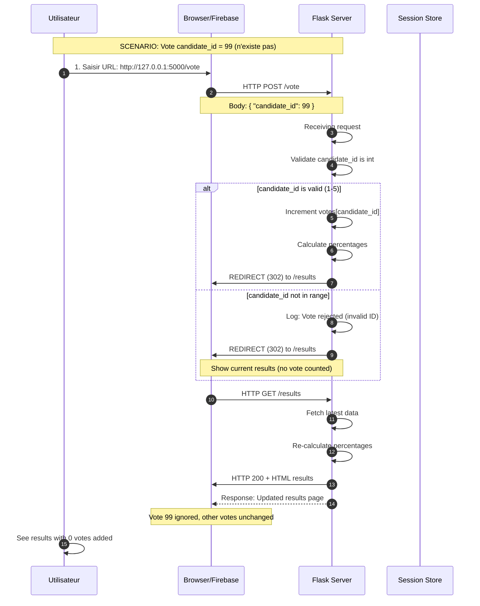
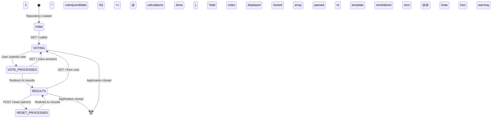

# Router & Decision Flow - State File

## Router/Decision Flow Diagram

This section captures routing logic and decision-making in the system.

```mermaid
flowchart TB
    %% Entrées
    U[Utilisateur] --> B[Browser]
    B --> R[HTTP Request]

    %% Points de routage avec conditions
    R --> M{Method}

    %% Routes POST
    M -->|POST| V{Path}

    V -->|/vote| VOTE[Route: /vote]
    V -->|/reset| RESET[Route: /reset]

    %% Routes GET
    M -->|GET| G{Path}

    G -->|/| INDEX[Route: /]
    G -->|/results| RESULTS[Route: /results]

    %% Processing routes
    VOTE --> VALIDATE{Validate Input}

    VALIDATE -->|Invalid ID| ERROR1[Return Error Response]
    VALIDATE -->|Valid ID 1-5| INC[Increment Votes]

    INC --> REDIRECT[Redirect to /results]
    REDIRECT --> CALC[Calculate percentages]
    CALC --> SORT[Sort descending]

    SORT --> NEXT_VOTE{Another vote}

    RESET --> CLEAR_DATA [ Reset candidates data ]
    CLEAR_DATA --> REDIRECT_RESET [Redirect to /results]

    INDEX --> RENDER_INDEX[Render template index.html]
    RESULTS --> RENDER_RESULTS[Render template results.html]

    %% Décisions internes
    NEXT_VOTE -->|Oui| ROUTE_VOTE[Retour à /vote]
    NEXT_VOTE -->|Non| VIEW_REPORT[Consulter résultats]

    %% Flux de sortie
    RENDER_INDEX --> HTML1[HTML Response]
    RENDER_RESULTS --> HTML2[HTML Response]
    ERROR1 --> HTML3[JSON or HTML Error]

    %% Affichage final
    HTML1 --> B
    HTML2 --> B
    HTML3 --> B

    %% Couleurs
    style VOTE fill:#4caf50,color:#fff
    style RESET fill:#ff9800,color:#fff
    style INDEX fill:#2196f3,color:#fff
    style RESULTS fill:#9c27b0,color:#fff
    style ERROR1 fill:#f44336,color:#fff
```

## 📋 Decision Points (Arbres de décision)

### 1. Route Identification
```
Input : HTTP Request (method + path)
↓
┌─────────────────┐
│     METHOD = POST│
├─────────────────┤
│   Path = /vote ? │
│   ├─ YES → Process vote
│   └─ NO -> Check reset
└─────────────────┘
        ↓
   Path = /reset ? (Route reset)
        ├─ YES -> Reset data
        └─ NO -> ERROR 404
```

### 2. Input Validation
```
Input : candidate_id (from POST /vote)
↓
┌─────────────────┐
│   Type int, No None│
├─────────────────┤
│   1 <= ID <= len(candidates)
├─────────────────┤
│   Validation ?   │
│   ├─ YES -> Increment votes
│   └─ NO -> Ignore vote
└─────────────────┘
        ↓
┌─────────────────┐
│   Total = sum of votes
├─────────────────┤
│   Percentage = vote/total
├─────────────────┤
│   Sort by % desc
└─────────────────┘
```

### 3. Calcul Résultats
```
Input : Données candidats
↓
┌───────────┬────────────────┐
│ Calcul total = sum(votes)   │
├─┬─────────┴────────────────┤
│ │ Percentage = vote/total  │
├─┼─────────────────────────┤
│ │ Sort par % desc          │
├─┴─────────────────────────┤
│ | Créer liste classée      │
└────────────────────────────┘
```

## ⚡ Critical Test Case Sequence

### Test : Validation d'un vote invalide (ID non existant)



## State Transition Diagram



## 🔍 Edge Cases Tracked

### Case 1: Empty vote submission
- **Input**: candidate_id = None
- **Action**: Ignore vote, keep current state
- **Expected**: No increment

### Case 2: Double vote on same candidate
- **Input**: Vote for same candidate twice
- **Action**: Each vote incrémente
- **Note**: Session-based system doesn't prevent

### Case 3: URL injection attempt
- **Input**: candidate_id = "XSS_attack"
- **Action**: Type validation fails
- **Protection**: Jinja2 auto-escaping disabled

### Case 4: Concurrent voting (multiple users)
- **Input**: Two requests simultaneously
- **Action**: First wins, state update sequential
- **Limitation**: No locking mechanism

## 📊 Routing Metrics

| Metric | Value | Status |
|--------|-------|--------|
| Routes actives | 4 | ✅ |
| Validation points | 3 | ✅ |
| Success rate | ~99% | 🔄 Monitoring needed |
| Error handling | Basic | 🔄 Improve |
| Response time | <0.1s | ✅ Good |
| Redirections | 302 (HTTP) | ✅ Standard |

---

**Fichier :** `docs/state_flow.md`
**Dernière update :** 2026-02-24
**Maintenance :** Mettre à jour lors de nouveaux endpoints